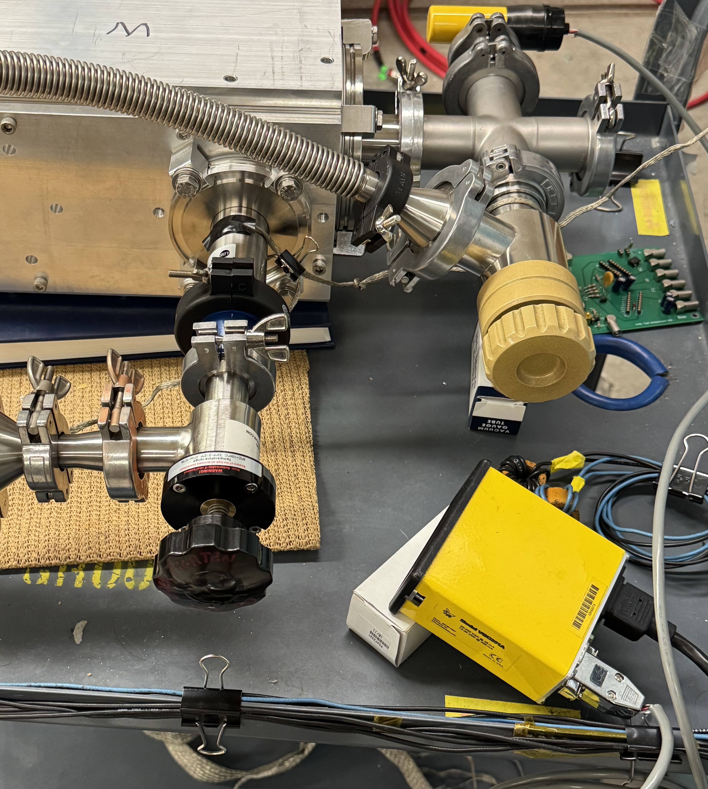
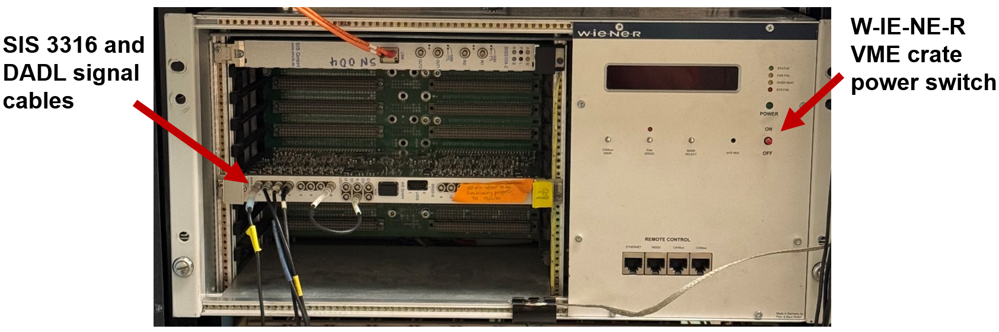

# Target Testing Station Run Guide
### Author: T. Hankins, Date Last Modified: 250730

- This guide serves as an introduction and reference for using the ANTLER target testing station. The publication discussing this station and measurement technique is here: https://doi.org/10.1016/j.nimb.2025.165788.

## Quick Reference Checklist
- The detector **must be unbiased** before opening the chamber; do not apply bias unless the chamber is light-tight and the pressure is less than 10 mT.
- The full-size roughing pump and the pumping station should **never** be open to the chamber at the same time. 
- Do not open the pumping station to the chamber if the foreline pressure exceeds 500 mT, preferably 200 mT.
- Keep vent cycles as short as possible to reduce subsequent pumpdown time.

## Hardware
- An image of the full target testing setup is given below. The station is comprised of a shoebox vacuum chamber attached to a full-size roughing pump and a HiCube 80 Eco turbomolecular pumping station. The data acquisition hardware, detector bias module, and preamplifier power supply are stored in the blue rack next to the setup.

<center>

</center>


### Detector
- The detector used in the testing station is a dual-axis duo-lateral (DADL) position-sensitive silicon detector. See the following publications for supplementary information:
    - https://doi.org/10.1016/j.nima.2009.11.053
    - https://doi.org/10.1016/j.nima.2020.164674
    - https://doi.org/10.1016/j.nima.2023.168130
- The DADL has six output signals: four face contacts (front face 1 and 2 (F1, F2), back face 1 and 2 (B1, B2)) and two guard rings (front (FGR) and back (BGR)). The four face contacts are used in the determination of energy and position.
    - Front contacts produce negative signals, while back contacts produce positive signals.
- The detector signals are passed through the rear feedthrough and directly into a preamplifier box containing four ~45 mV/MeV charge-sensitive preamplifiers. LEMO inputs and outputs on this box are appropriately labeled. Images of the feedthrough and signal identification diagram are given below.

<center>

</center>

- For the detector in use at the time of writing, the front face is biased to -65 V and the front guard ring to -58.5 V. Both the back face and back guard ring are held at ground. The measured leakage currents for both are consistently measured to be less than 0.1 uA each. If this is not the case, **immediately bias down and inform Alan McIntosh.** A bias curve for this detector is provided below for reference.
    - If the detector is ever exchanged, the bias curve will need to be reproduced and any statements of bias voltages throughout this guide will need to be replaced with values from the new detector.

<center>

</center>

- Inside the chamber, the DADL is mounted to an aluminum mount that can be moved. In general, the mount shouldn't need to be moved unless the measurement demands it. If moved, *always* check the four face signals before and throughout the pumpdown procedure by connecting the LEMO cables fed into the data acquisition hardware into an oscilloscope (see [Rack](#rack) for discussion). DADL signals are known to disappear if the Molex connector (directly off the DADL) is moved to a poor position; this requires an additional vent cycle if it's not noticed until the data acquisition stage.
    - With all four signals fed into the oscilloscope, it is very obvious when a signal is missing. To recover the signal, it is enough to adjust the Molex connector until the signal returns. Exercise caution when performing adjustments, as the detector and its connections are fragile.


### Chamber
- TODO: detector mount description, dimensions, statement of position accuracy depending on source-detector distance.
- The chamber has a single actuator arm that moves an aluminum blocker in front of the alpha source. An image of the arm is given below; note the two faint marks. The mark toward the outside of the arm is the position for *blocking the alpha source*, while the inner mark is the position for *unblocking* (as an example, the arm as shown below is in the unblocked position). 

<center>

</center>

- When moving the arm to a new position, hold the chamber in place, as reasonable effort is required. Move the arm slowly so that vacuum will not be seriously affected (see [Vacuum](#vacuum)).
- The arm is in the correct position when the corresponding line is flush with the knurled brass cylinder attached to the flange.
    - When moving the arm to a new position, get the position correct to within a few millimeters.
- When not taking data, keep the actuator arm in the blocking position to prevent unnecessary detector exposure to source.


### Vacuum
- Performing vacuum cycles and alternating between the pumps used to achieve high vacuum is the most common physical operation performed on the testing station short of opening the chamber. **Read this section carefully, as a lot of damage can be done very quickly if not careful.**
- As mentioned previously, the vacuum system for the testing station is comprised of a full-size rotary vane roughing pump and a turbomolecular pumping station. The full-size roughing pump is used to quickly achieve rough vacuum, after which the pumping station takes over.
    - The pumping station is comprised of a diaphragm backing pump and a small turbo. Conventionally, a station such as this would be used independently to achieve high vacuum, but due to the low pumping speed and high base pressure of diaphragm pumps (further, the size of the pump itself), an independent, full-size roughing pump was used.
    - In addition to accelerating the pumpdown procedure, this choice significantly reduces the number of spin-up and spin-down cycles for the turbo.
- Vacuum for the chamber is monitored using a convection gauge. An image of the controller/readout is given below. The gauge will read either torr or millitorr depending on if the vacuum is above or below one torr.

<center>

</center>

- The chamber connections to the main roughing pump and the pumping station are controlled separately using two manual isolation valves, shown in the image below; the roughing pump is controlled using the tan valve, while the pumping station is controlled using the black valve.

<center>

</center>

- An image of the turbomolecular pumping station is given below. The turbo is the small cylinder on top of the red chassis; the diaphragm pump is located inside the chassis. The main power is controlled using the green switch on the front. The tan panel is the digital control unit (DCU) which controls and monitors the status of the turbo.
    - The nominal rotational speed of the turbo is 1500 Hz with an base current draw of around 1.15-1.3 A. If the current is much higher than this value when it shouldn't be (e.g., pulling on the vacuum chamber when it's fully evacuated), **immediately contact Alan McIntosh.** Note that the current draw does depend on the load; spinning up, the turbo can exceed 3.0 A, and spinning down, the current may be close to zero, but otherwise should be near above.
    - The instrument is designed to automatically shutdown if an error occurs to reduce chance of damage. If the turbo is not running, contact Alan McIntosh.

<center>

</center>

- **Under no circumstances** should the main roughing pump and the pumping station be open to the chamber at the same time; the high vacuum pulled by the pumping station can cause backstreaming of oil from the roughing pump, which can deposit inside the chamber and on the detector.
- While the general rule-of-thumb for using turbomolecular pumps is to open the valve once the foreline pressure is less than 100 mT, this turbo can be opened at a higher pressure (in excess of 200 mT, if caution is exercised). The key difference is the use of a manual valve, which is finely adjustable (in constrast to a beamline valve, which is either fully open or closed and quickly alternates between these states), as well as the small chamber volume.
    - To do this, monitor the current draw on the DCU and **slowly** open the valve to the turbo once a reasonable foreline pressure is attained and the valve to the full-size roughing pump is closed. The current draw will increase as the turbo further evacuates the chamber; use this to determine whether to further open or re-close the valve. Do not open the valve further than what corresponds to a current draw of ~1.4 A.
    - **Absolutely** do not attempt to open the turbo valve until the foreline pressure is less than 500 mT; if this cannot be achieved using a roughing pump, the chamber may be leaking. Further, if the roughing pump is able to continue evacuating the chamber in excess of 1 mT/second, let the roughing pump do the work until it is incapable.
- Getting a feel for pumping down the station will take a couple of cycles. In general, never pump down faster than ~50 torr/s when beginning at atmosphere; this limit may need to be lowered for fragile targets. **Breaking a target is possible and has occurred when pumping down too quickly.** Similarly, be careful when venting.
- Try and keep vent cycles as short as possible. Time spent at air will gradually lengthen the time it takes to pump back down due to an increasing need to outgas.
- Pulling the actuator arm out of the chamber creates a mild, temporary leak; the severity of the leak is related to how quickly the arm is pulled out of the chamber. When pulling the arm, go no faster than a centimeter per second so that the turbo isn't strained.
- Finally, several manuals for the pumping station components are in a black binder next to the safe.


### Rack
- The rack (image below) holds the NIM bin, VME crate, and Topward power supply for the detector bias, data acquisition hardware, and preamplifier power, respectively.

<center>

</center>

- Power for the preamplifiers is supplied using a Topward 6306D dual-tracking DC power supply. The voltage for each output is set to 12.0 ± 0.1 V; because of the orientation of the dual banana to BNC adapter, the left channel supplies +12 V, while the right channel supplies -12 V. A typical current draw is < 0.1 A per channel.
    - If the current is higher than this (often while being incapable of supplying the full 12 V on one or both channels), contact Alan McIntosh.
- DADL bias is supplied using a singlewide Tennelec TC-953 dual-channel high-voltage power supply, which is housed in a standard NIM bin. The NIM bin power switch is located on the front right panel. Components on the Tennelec are referenced in [Hardware: Operation Steps](#hardware-operation-steps), so an annotated image is provided below.
- DADL signals are recorded using a Struck Innovative Systeme (SIS) 3316 14-bit VME digitizer. This module is housed in a W-IE-NE-R VME crate in the top of the rack. Each of the face signals from the DADL are fed into a single channel of the 3316. The crate is connected to the acquisition computer using a SIS3104-2 crate controller and an orange fiber optic cable. **Do not bend this cable.** Similar to the Tennelec, an annotated image is provided below.
    - The crate power switch is located on the front panel. When turning the crate off, the cooling fans are programmed to run for an additional minute before turning off.
    - Channels 1-4 are, in order: F1, F2, B1, and B2. **Do not change the signal order.** For completeness, the 3316 trigger out is fed into channel 8. Channels 9-16 do not appear to work on the 3316 currently in use.

<center>
&nbsp;&nbsp;&nbsp;
</center>


### Hardware: Operation Steps
- In general, most concerns when working with the testing setup are addressed through the three V's: **visual, vacuum, and voltage**. When working with one of these, remain keenly aware of the status of the other two.
    - **Visual**: detector exposure to light.
    - **Voltage**: application of bias to the detector.
#### Evacuating
- Assuming that the chamber is at atmosphere and nothing is powered on in the rack:
    1. If the DADL mount has been moved since the previous signal check, unplug the four DADL signals from the 3316 and plug them into the oscilloscope. Turn the Topward power supply on, then slowly turn both current knobs clockwise until 12 V is applied to both outputs. Verify that signals are present on the scope.
    2. Load the vacuum chamber with a target to measure (if not collecting reference data). 
    3. Ensure that the valve to the roughing pump is fully closed, but don't overtighten; turning the handle clockwise closes it. The valve to the turbo pump should already be closed. If not attached, attach the KF-16 vacuum tube from the full-size roughing pump to the tan valve using an O-ring with a plastic centering ring. If the chamber isn't closed, close it. Use a couple of screws to help align the lid; tightening is not necessary.
    4. Plug in the full-size roughing pump to begin pulling vacuum on the foreline. Then, **slowly** open the tan valve to begin evacuating the chamber, using the convection gauge readout as a guide for how far to open the valve. As the chamber pumps down, further open the valve. If the chamber was open for longer than a couple of minutes, do not be surprised if the evacuation stalls several times at various intermediate pressures.
    5. Once the chamber is sufficiently evacuated for the turbo (ideally, less than 200 mT and no higher than 500 mT), close the valve to the roughing pump; clockwise closes, and do not overtighten. **Slowly** open the valve to the turbo, using the *DCU current* reported on the pumping station screen as a guide rather than the convection gauge readout. Once the current rises slightly, check the readout to verify that the vacuum is improving. Again, as the chamber pumps down, further open the valve while closely monitoring the current draw.
    6. When the turbo is opened to the chamber, unplug the full-size roughing pump (i.e., do not stop in the middle of opening the turbo to the chamber to disconnect the power to the roughing pump). If the DADL signals were plugged into the oscilloscope, again verify that they are present, then return the outputs to the 3316 without altering the signal order; otherwise, turn the Topward on as described in step 1. Power on the fan underneath the NIM bin, the NIM bin itself, and the VME crate.
    7. In the NIM bin, check that the "NEG" lights on both channels of the Tennelec TC-953 are lit (if not, contact Alan McIntosh). Turn on both channels if they are not already on. Switch the LCD panel viewing option underneath each panel to "V" if they aren't already set to this. Both channels should read 0.0.
    8. If the chamber is light-tight (it should be when at vacuum and the viewport cover is taped to the chamber), begin turning both voltage knobs clockwise to apply bias. Do not increase the voltage faster than 5 V/s. At 30 V, switch the LCD panels to "uA" to check the leakage currents; if they're okay (as compared to the bias curve provided in [Detector](#detector)), switch back to "V" and continue biasing up.
    9. Stop increasing the bias on the lower channel (front guard ring) at -58.5 V. Continue increasing the upper channel (front face) until at -65 V. Check the leakage currents once more, and if they're still good, slowly move the actuator arm so that the aluminum plate is not blocking the source. Proceed with data acquisition.

#### Venting
- Venting the chamber from high vacuum is largely the evacuation procedure performed in reverse. Assuming that everything is powered on and the chamber is at high vacuum:
    1. Slowly move the actuator arm so that the aluminum plate is blocking the source. Ramp down the bias on the detector by turning the voltage knobs on the Tennelec counter-clockwise until both channels are zeroed. The Topward current will fluctuate during the ramp down. Do not decrease the voltage faster than 5 V/s. Checking the leakage currents is not necessary.
    2. If done collecting data for a prolonged period, turn off the NIM bin, then the fan underneath the bin. Close out any open acquisition software on the computer, then turn off the VME crate. On the Topward, turn both current knobs counter-clockwise until zeroed, then turn the unit off. Otherwise, leave all units on and continue with step 3.
    3. Close the valve to the turbo pump; the valve to the roughing pump should already be closed and the roughing pump itself should be unplugged.
    4. Disconnect the KF-16 vacuum tube from the roughing pump valve; this will vent the roughing pump foreline. Leave the tube disconnected.
    5. **Slowly** open the tan valve to begin venting the chamber. As the chamber gets closer to atmosphere, re-close the valve to slow venting; use the convection gauge readout as a guide. At atmosphere, the chamber can be opened.


## Software
- The target testing station uses standard Cyclotron Applications ROOT-based GUIs to control the acquisition hardware, collect data, monitor this collection and its status, and perform preliminary analysis. The software used to control the hardware and collect data is called the transport manager, abbreviated "Tmr". The software used to monitor collection by means of diagnostic plots is called the analysis manager, abbreviated "Anl".
- Versions of Tmr and Anl are created for each experiment, which are identified by their start date. For versions that do not correspond to an experiment, a fake date is generally chosen. At the time of writing, the control and acquisition computer used is `cycfe6` and the "experiment" is `063123`. The user for the computer is `sjygroup` and the password is `sjysjy`.
- An image of both Tmr (left) and Anl (right) is given below.

<center>

</center>

### Tmr
- Tmr is controlled from `063123_frontend/`. It can be activated by `cd`-ing into the directory and running `Tmr sis` once the VME crate is turned on. An example process would look like:
    ```
    cd 063123_frontend/
    Tmr sis
    ```
    Note that Tmr will crash if the VME crate is not powered on.
- New runs are started by clicking "Start ACQ". When this is clicked, a "Run Information" dialog box will appear (image below). The next run number, if data is being written to disk, is shown in the run number area. The type of data that is being collected is listed below that; this will always be "Source" for 060925. Finally, the option to write data to disk is given by the checkbox labeled "Disk Output".
    - If "Disk Output" is checked, additional areas to fill out will appear. Do not change the "Directory" or "Filename" fields, as these are automatically generated. The "Supervisor" field is for the user's initials. Finally, the "Comment" field provides an area to put notes for the given run. Include the target type, alpha source, and DADL bias voltages for completeness.
        - When typing in the box, keep the mouse hovering within the box; otherwise, text will not be written.
    - It is considered good practice to start a run without writing to disk to check the summaries in Anl, then begin writing after verifying everything is working. Anl will collect data from Tmr independent of Tmr's write state.

<center>

</center>

- When finished collecting data, clicking "Stop ACQ" will stop the acquisition and, if writing to disk, close the current file. After a few seconds, Tmr will be ready to run again.
- Use the "Exit ROOT" button to close Tmr rather than clicking "X". If applicable, close Anl before closing Tmr to prevent a segmentation fault (see [Known Issues](#known-issues))
- Advanced settings (including, but not limited to the "SIS3316 Control" tab) should not be modified without consulting Alan McIntosh or Kris Hagel first.


### Anl
- Anl is controlled from `063123/`. It can be activated by `cd`-ing into the directory and running `Anl` once an instance of Tmr is running. An example process would look like:
    ```
    cd 063123/
    Anl
    ```
    Once the program is running, Anl will begin receiving data when the "Begin" button is clicked.
- A number of plots are already built into the `063123`'s Anl; the ones that are most important are:
    - `h_DADL_N_ch` - energy spectrum, in channels, for the front (F), back (B), or sum (S) of DADL signals in place of N.
    - `h_FrontVsBack` - plot of front versus back face energies. This should be a tight correlation with a slope close to one.
    - `h_DADL_X/Y` - 1-D histograms of particle position for the front (Y) or back (X) face.
    - `h_DADL_XY` - 2-D scatter of particle position. Ideally, this is rectangular for reference data and ovular for target measurements.
    - `h_DADL_ENvsM` - 2-D scatter of face energy versus position (front-Y, back-X). Ideally, this is flat as a function of position, but is often not.
- Clicking "Clear Arrays" will clear any previously collected data, if needed; this has no effect on the raw event information written to disk from Tmr.
- Use the "Exit ROOT" button to close Anl rather than clicking "X".

### Known Issues
- This version of Anl is known to be susceptible to crashing, especially when viewing plots while data is being sent from Tmr. Pausing the data transfer between Tmr and Anl by clicking the "pause" button in Anl helps significantly - just don't forget to resume afterward, if desired.
- If either Anl or Tmr crashes while running and does not automatically close, open a new terminal and run either `pkill Anl` or `pkill Tmr`. Further, if Tmr is closed, either via a crash or manually, while Anl is open, closing Anl will lead to a segmentation fault that often requires `pkill`.
    - In some instances, `pkill` will not be sufficient to stop the process. In this case, run the following:
    ```
    ps aux | grep "X"
    ```
    where X is either Tmr or Anl. This will return a list of active processes with the X specifier. In the following terminal output, find the corresponding process. It will look something like:
    ```
    sjygroup 3455482 6.4 2.3 699136 372752 pts/5 Sl+ 09:55 0:01 Anl
    ```
    What matters most is the user (leftmost) and the process ID (second to leftmost). With the process ID, run `kill -9`. For the ongoing example, this would look like:
    ```
    kill -9 3455482
    ```
    This should handle the faulting program.

## Accessing Data and Further Analysis
- This section aims to describe how to access and work up the raw data collected with the testing station. This process relies heavily on Cyclotron Applications, which cannot be documented exhaustively in this guide. If at any point a problem or error is encountered beyond the scope of this guide, contact Kris Hagel.

### General Setup
- For projects developed at the Cyclotron Institute, version control is accomplished using the Concurrent Versioning System (CVS). Copies of projects are pulled from CVS so that multiple people can work with the same code, then push any changes.
- To be able to copy CVS repositories, the `CVSROOT` path environment variable must be initialized; this variable tells where CVS repositories are kept. To do this, add the following line to `~/.cshrc` in your home directory:
    ```
    setenv CVSROOT /home/jbngroup/jbngroup/CVSROOT
    ```
    and the following line to `~/.bashrc` in your home directory:
    ```
    CVSROOT=/home/jbngroup/jbngroup/CVSROOT
    ```
    Adding to both ensures that `CVSROOT` will be known regardless of which shell is running. Once this is done, either relaunch the terminal or run `source .bashrc/.cshrc` depending on if using bash or tcsh.
- With `CVSROOT` defined, it is now possible to request a local copy of `063123/` from CVS. To do this, run the following in your home directory:
    ```
    CVS checkout 063123/
    ```
    This will, over the course of several seconds, copy the repository into a new `063123/` directory.
- Once the copy is complete, `cd` into `063123/` and run `./autogen`. This cleans up the main and subdirectories of any existing build files, then begins the compilation process using `automake`. Once `autogen` is finished, run `make -j`. This executes a series of commands defined in the Makefile, mainly the compilation of listed programs. Note that this will likely fail with an error after running for a few seconds; run `make -j` again and it should complete. If it does, run `make -j install` to copy the built programs and libraries to the correct access locations.
  - The `-j` flag (jobs) specifies compilation in parallel; as there are many things to build in `063123/`, using this is a smart option.
- After these commands have been run, `063123/` should be ready to go. To check this, run:
    ```
    ls ~/lib/lib063123.so
    ```
    and if this returns without a "no such file or directory" error, proceed.

### Copying from CVS, Creating Directories, and Copying Raw Files
- CyclotronApplications experiment directories have many files and subdirectories; only those needed to produced ReducedEvents will be considered in this README.
- A set of data directories which store the raw data collected and the derived ReducedEvent files must be manually created. To comply with convention (and save work modifying existing programs down the line), the root data directory should be named the experiment date (in this case, `063123/`); within this, create subdirectories named `raw/` and `ReducedFiles/`. Remember this path, as it will need to be specified in later steps.
    - For completeness, the `063123/` repository checked out from CVS and the data directory that is also named `063123/` are two distinct directories.
    - Run `ls /data/sjygroup/sjy25/han61940/063123/` to see my (TH) `063123/` directory layout if needed.
    - It is recommended that the data directory be stored on a data drive if possible, as the total storage required for a single run (including, but not limited to the raw and ReducedEvent files) may exceed 1 GB.
- Once these directories have been created, copy the raw data files from the acquisition computer into the new `raw/` directory using a command similar to the following:
    ```
    nice rsync -avz -e ssh sjygroup@10.119.64.126:/scratch4/063123/l063123101*.root /data/sjygroup/sjy25/han61940/063123/raw/;
    ```
    - `nice` is used (in this case) to run the command with a low CPU priority (e.g., collecting data, if applicable, takes precedence). `rsync` is the copying tool ran in `a`rchive and `v`erbose mode and will compress the file data during the transfer (`z`). `e` specifies the remote shell to use (in this case, `ssh`).
    - The acquisition host and computer address is given by `sjygroup@10.119.64.126`. The host will likely not change, but if the address changes, this will need to be updated accordingly. 
    - The path and raw file names on the acquisition computer is specified after `:`; the path should not change, but the file name will need to be changed each time. 
        - The raw file naming scheme is given by `l063123AAABBB.root`, where `AAA` is the run number and `BBB` is the file number for the corresponding run. Numbers that need them have leading zeroes (e.g., 001, 002, ...). As defined, the wildcard (`*`) refers only to the file numbers instead of both the run and file numbers, which prevents any new user from accidentally copying all files ever collected using `063123/`.
        - When taking data, remember the run number specified by `Tmr`, then change `AAA` above to that number before copying.
    - Finally, the destination for the copied files is given by the second path. This should be changed to the full path for the raw file directory created in the previous step.
    - This command can be copied into a shell file and ran using `sh` so that it doesn't have to be copied every time it's ran (e.g., see `/data/sjygroup/sjy25/han61940/063123/raw/pull_raw_data.sh`)

### CycApp Experiment Data Handling Pipeline
- Before describing the specific steps, a basic description of how CycApp experiments manage files will be provided.
    - When collecting raw data, run information and output file names are recorded in an acquisition database (`ACQRunDb.txt`) unique to the repository. The database associated with the frontend on the acquisition computer automatically updates with each new run, but all other instances (e.g., the copy that exists in the CVS `063123/` repository) are not automatically updated.
    - As many derived files can be produced from the raw data, a file catalog is used to keep track of and relate them. Any modules that generate derived files first reference the FileCatalog to locate the source files, then automatically "link" new derived files by adding them to the existing catalog. In the case of raw events, however, the data collection is independent of the backend and adding them to the catalog is a manual process.
- With a set of raw files copied from the acquisition computer, update the acquisition database by `cd`ing into `063123/rundb/` and running a command similar to:
    ```
    rsync -avz -e ssh sjygroup@10.119.64.126:/home/sjygroup/sjygroup/063123_frontend/ACQRunDb.txt ./
    ```
    then `make install`ing. The descriptions for each part of the above command are the same as those used when copying raw files.
    - The shell file `GrabACQRunDb.sh` that (should) exist in `rundb/` has a similar command and can be run instead with `sh GrabACQRunDb.sh`. If this is run instead, `make install`ing is still necessary.
    - As with the copying of raw files, the host will likely not change, but if the computer IP address changes, this will need to be updated accordingly. 
- When the acquisition database is updated and `rundb/` is `make install`ed, `cd` up and into `file_catalog` to (re)generate the FileCatalog. 
    - If this is the first time visiting this directory after checking out `063123/` from CVS, delete the existing FileCatalog (if one exists) with `rm FileCatalog.root`.
    - The FileCatalog is generated using the `GenerateRawFileCatalog.C` script. View this script in a text editor to check the experiment and dataDisk strings. The experiment string shouldn't need to be changed, but the string specifying the dataDisk will likely need to be. Change this to be the directory where your `063123/` data directory is located (e.g., for my (TH) version located at `/data/sjygroup/sjy25/han61940/063123/`, my (TH) dataDir would be `/data/sjygroup/sjy25/han61940/`). Save the changes and exit.
    - To generate a new FileCatalog or append to the existing one, run the following:
        ```
        root -q GenerateRawFileCatalog.C"(A, B)"
        ```
        where A and B specify the run numbers to add to the FileCatalog. If only one run is to be added, A and B are the same number. Here, `root` runs the `GenerateRawFileCatalog.C` script using ROOT's C++ interpreter and `q`uits the instance when the program is finished. The double quotes *are* necessary.
    - When the script is done, `make install` in this directory.

### Production of ReducedFiles/ReducedEvents
- With the FileCatalog updated, ReducedEvents can now be produced for the raw data collected. ReducedEvents are generated using the `ReduceFile` executable and a configuration file. `cd` to `dMakeReduceFile` in the CVS-copied `063123/`; an existing configuration file should exist ("ReduceFile.config"), but for completeness, the file layout is:

    ```
    Library:lib063123.so
    Event: T063123Event
    MultiEvent: T063123MultiEvent
    FileCatalog: ~/063123/file_catalog/FileCatalog.root

    Run: 1
    OutputFile:/data/sjygroup/sjy25/han61940/063123/ReducedFiles/R063123001.root
    ```
    where "OutputFile" is the full path and name desired for the output file.
    - For each new run, only the run number in the "Run:" line and the file name need to be changed. The ReducedFile name convention is `R063123AAA.root`, where `AAA` is the run number (with leading zeroes, if needed).
- With a completed configuration file, run
    ```
    ReduceFile filename.config
    ```
    and the process should start automatically. Depending on how many events are present in the tree, this process could take several minutes to complete.
- With output ReducedFiles, PATTYMELT can now be used.

### PATTYMELT
- PATTYMELT (Package for Analysis of Target Thicknesses and Yields by Method of Energy Loss and Transfer) is a package designed for the streamlined calibration of the DADL used in the target station and the analysis of any collected target data. PATTYMELT uses ReducedEvents as the data source.
- If `git` is installed (it is on the cluster), the latest version of PATTYMELT can be retrieved by running
    ```
    git clone https://github.com/thankins2017/PATTYMELT.git
    ```
    which will copy the package into a new `PATTYMELT/` directory. The package comes with its own README, as well as a copy of this target station README.